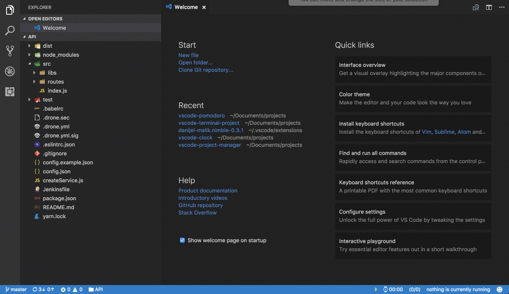

# VSCode-Pomodoro
[](https://marketplace.visualstudio.com/items?itemName=yahya-gilany.vscode-pomodoro)

Better Manage your time and be more effecient with your development work.

For more information about the Pomodoro Technique: [Visit this link](https://cirillocompany.de/pages/pomodoro-technique)


## Installation

Press F1 in VSCode, type 
```
ext install vscode-pomodoro
```

## Usage

### Add tasks
First you'll need to add tasks to the extenstion to time-manage it for you.
 
> ``` Pomodoro: Add New Task ```

### Start The Pomodoro
Simply by clicking on the Green Button next to the timer in the status bar, the pomodoro cycles start and you're good to go... 

The tasks added to the extension are persisted throughout vscode windows.
The counter in the status bar shows the number of completed tasks over the number of tasks.

you many, sometime, start with a clean slate and reset the counter of the completed tasks.
you can very easily do that with the following command:
``` Pomodoro: Clear Completed Tasks```
Dont't worry.. Tasks that hasn't been completed will remain intact.

## Extension Settings

This extension contributes the following settings:

* `"pomodoro.task_duarion"`: The default duration of a Pomodoro Task in minutes
* `"pomodoro.break_duarion"`: The default duration of a Break in minutes
* `"pomodoro.long_break_duarion"`: The default duration of a long Break in minutes
* `"pomodoro.counter_to_long_break"`: number of regular breaks before a long break
* `"pomodoro.tasks_file"`: full path to the tasks.json file

## Known Issues

Please Report any issue to the Git repository.

The extension was only tested on macOS, some issues may arise on other Operating systems. 

Please feel free to file new issues and submit pull requests to resolve any issue you may have.


## Release Notes

please refer to the change log CHANGELOG.md

**Enjoy!**

## License

MIT © Yahya Gilany
